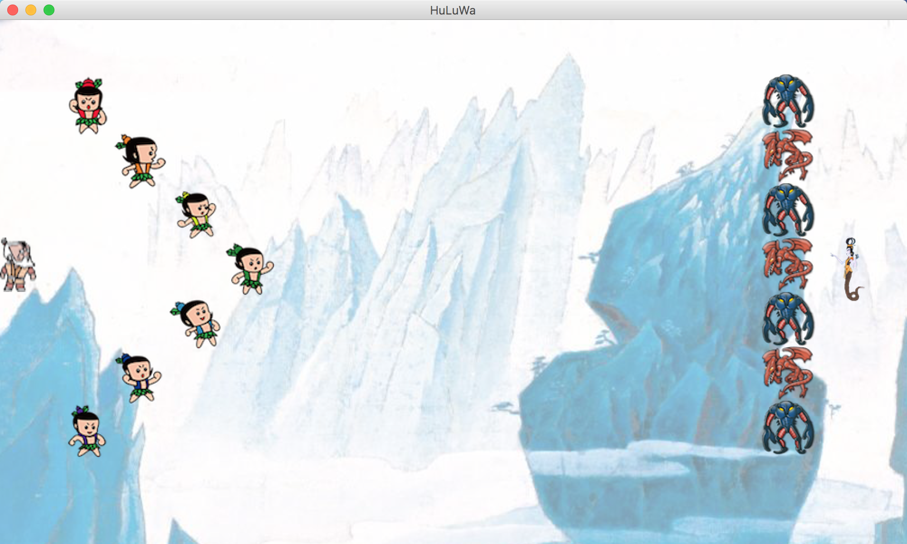

# 葫芦娃大战妖精   

#### 151220026 冯一洲 v0.9

##### 操作方式：

1、按下SPACE键，游戏自动开始

2、开始前或者结束后按下L键，可以加载回档

3、按下R键重新开始游戏

这是游戏截图

葫芦娃由老爷爷带队排列在左侧，妖精们由蛇精带队排列在右侧，他们将在这里厮杀一场

### 类设计

Main是游戏的入口，将会创建一个Game类对象；

Game类中会创建起来Field类对象，这是游戏场景发生的地方；

在Field中有各种与游戏相关的人物与场景；

Thing2D对象是可以显示在屏幕上的对象，Creature类继承自Thing2D类并实现Movable接口；

生物分为GoodMen和BadMen，都继承自Creature；

God是一个全能的上帝，他将管理所有的生物；

Holder是保存生物的容器，在Field中共有[N * M]个holder；

Foramtion类是对生物进行排阵的类，提供静态方法来对好人和坏人排队；

Replay和Record实现回放功能；

### 游戏逻辑实现

所有的生物均是一个线程，同时还应该有一个UI刷新线程，我决定采用CyclicBarrier工具来管理线程，这样UI线在每一轮生物更新好状态后才刷新；同时，上帝在这里出现，对当前局势进行判断，并给生物们一些建议（当然，他们也可以不采纳）

进入run()方法后，首先判断自己四周一格有没有敌人，有就发动攻击，没有再决定下一步往哪里进发；为了多线程的访问安全，所有关于位置信息、生物信息的访问都应该加以控制；

葫芦娃们很聪明，他们首先看x轴方向的敌人，有的话就马上前进一个，没有的话然后再找最近的y轴上的敌人；妖精们很糊涂，只能在x轴上瞎动；每一步生物可以选择动或者不动。

Record类在每次刷新时将当前局势记录下来，每轮游戏结束后进行写文件。

### 面向对象的设计原则

依赖倒置原则：所有生物类都依赖于虚类Creature类

里式替换：都可以用基类替换

观察者模式：“上帝“是局面的观察者

文档不全... 我会尽快补上

